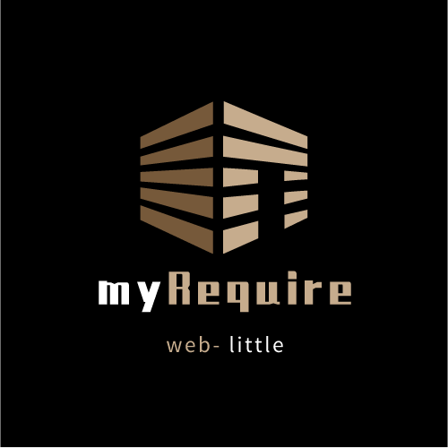

# 自己实现的require

<p align="center">
    
</p>
<p align="center">
    <a href="javascript:;"></a>
    <a href="javascript:;"></a>
    <a href="javascript:;"></a>
    <a href="javascript:;"></a>
</p>

---
### 👋 为什么要做这个？

主要是学习node require 思想，最终汇总模块化的知识点（还未写完，最后会输出文章和视频，渐进式的来实现一个require，目前v1.0.0 是最入门的实现，代码不到30行）

---
### 📫 功能介绍

> 版本：v1.0.0

- [x] module.exports = {} 基本引入

---

### 🛠 开发与调试

```sh
# 下载依赖
npm install

# 开发调试
npm run start

# 测试
npm run test
```

---

### 🏆 源码目录介绍

- src: ts源文件
- dist: ts转换的js文件
- test: require测试
- assets: 放置一些图片和图标


